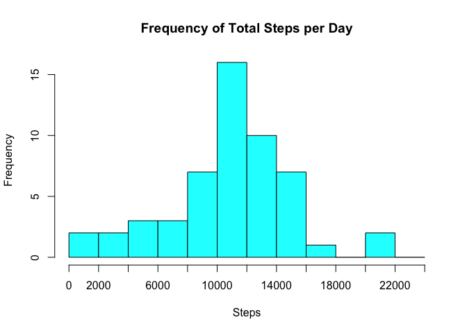
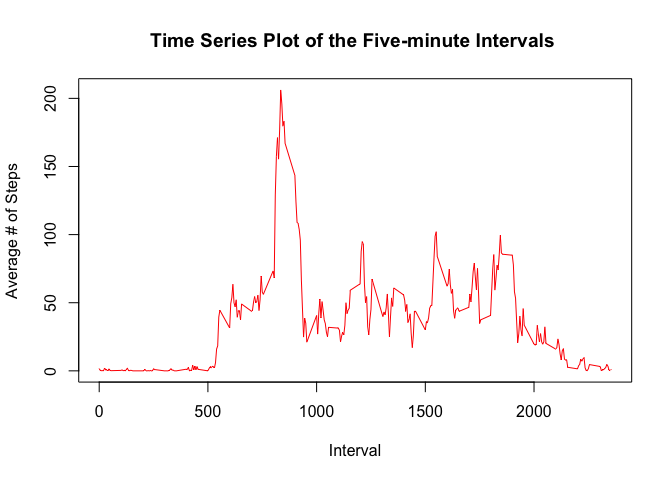
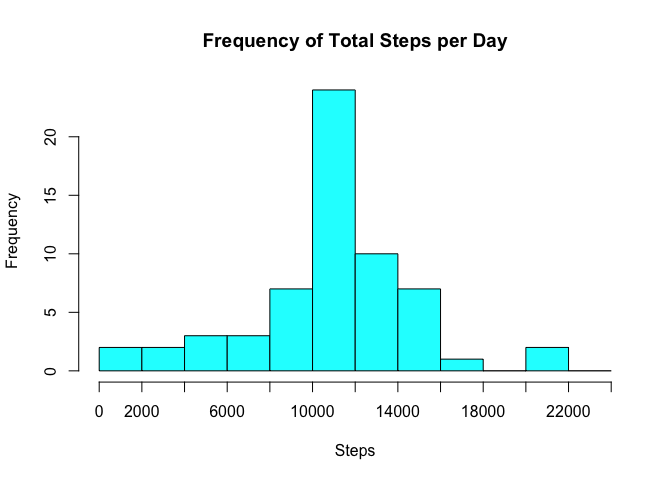
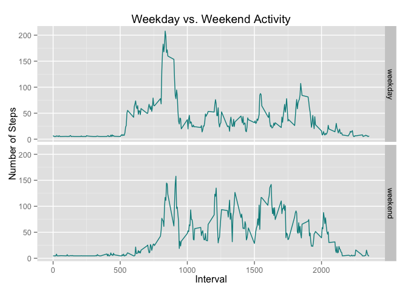

# Reproducible Research: Peer Assessment 1
## Preparation


```r
setwd("~/Desktop/coursera/RepData_PeerAssessment1/RepData_PeerAssessment1/")
library("knitr")
```

```
## Warning: package 'knitr' was built under R version 3.1.3
```

```r
library(lattice)
#install.packages("Hmisc")
library (Hmisc)
```

```
## Warning: package 'Hmisc' was built under R version 3.1.3
```

```
## Loading required package: grid
## Loading required package: survival
## Loading required package: splines
## Loading required package: Formula
```

```
## Warning: package 'Formula' was built under R version 3.1.3
```

```
## Loading required package: ggplot2
```

```
## Warning: package 'ggplot2' was built under R version 3.1.3
```

```
## 
## Attaching package: 'Hmisc'
## 
## The following objects are masked from 'package:base':
## 
##     format.pval, round.POSIXt, trunc.POSIXt, units
```

```r
library(data.table)
```

```
## Warning: package 'data.table' was built under R version 3.1.3
```

```r
library(ggplot2)
#install.packages("chron")
library(chron)
```

```
## Warning: package 'chron' was built under R version 3.1.3
```

## Loading and preprocessing the data

```r
path = "~/Desktop/coursera/RepData_PeerAssessment1/RepData_PeerAssessment1/"
unzip(paste(path, "activity.zip", sep = ""), exdir = path)
rawdata <- read.csv("activity.csv", sep = ",") #variables are steps, date, interval

unzip("activity.zip")
rawdata <- read.csv("activity.csv", sep = ",", colClasses = c("integer", "Date", "integer"))
```

## What is mean total number of steps taken per day?


```r
TotalStepsPerDay <- aggregate(rawdata$steps,list(date=rawdata$date),sum)
xAxisBreakdown = seq(from=0,to=25000,by=2000) 
```

```r
hist(TotalStepsPerDay$x,
      breaks = xAxisBreakdown,
      main="Frequency of Total Steps per Day",
      col="cyan",
      xlab="Steps",
      ylab="Frequency",
      xaxt="n")
axis(side=1,at=xAxisBreakdown,labels=xAxisBreakdown)
```

 
###Calculate the mean and the median of the total number of steps taken per day (10766.19 and 10765, respectively)

```r
MeanOfSteps <- round(mean(TotalStepsPerDay$x,na.rm=T),2)
MedianOfSteps <- round(median(TotalStepsPerDay$x,na.rm=T),2)
```
## What is the average daily activity pattern?


```r
steps.interval <- aggregate(steps ~ interval, data = rawdata, FUN = mean)
plot(steps.interval, type = "l", col="red", main="Time Series Plot of the Five-minute Intervals ", ylab="Average # of Steps", xlab="Interval")
```

 
###which 5-minute interval, on average across all the days inn the datset, contains the maximum number of steps? 835

```r
steps.interval$interval[which.max(steps.interval$steps)]
```

```
## [1] 835
```

## Imputing missing values

###Calculate the total number of missing values in the dataset (i.e. the total number of rows with NAs) There are 2304


```r
sum(is.na(rawdata))
```

```
## [1] 2304
```
###Strategy for imputing the missing values it to use the mean of the given interval to substitute for NAs (missing values)


```r
# make sure Hmisc library loaded for impute fcn
ReplacedMissingValuesData <- rawdata
# Used impute function from Hmisc library in next line
ReplacedMissingValuesData$steps <- impute(rawdata$steps, fun=mean)
sum(is.na(ReplacedMissingValuesData$steps)) #The number of NAs = 0 ok then...
```

```
## [1] 0
```


```r
NewTotalStepsPerDay <- aggregate(ReplacedMissingValuesData$steps,list(date=ReplacedMissingValuesData$date),sum)

hist(NewTotalStepsPerDay$x,
      breaks = xAxisBreakdown,
      main="Frequency of Total Steps per Day",
      col="cyan",
      xlab="Steps",
      ylab="Frequency",
      xaxt="n")
axis(side=1,at=xAxisBreakdown,labels=xAxisBreakdown)
```

 
###Calculate the mean and the median of the total number of steps taken per day (both 10766.19 now so mean and median are the same (at least to 2 decimal places))

```r
NewMeanOfSteps <- round(mean(NewTotalStepsPerDay$x),2)
NewMedianOfSteps <- round(median(NewTotalStepsPerDay$x),2)
```

## Are there differences in activity patterns between weekdays and weekends?

#Make sure chron library loaded for code below


```r
ReplacedMissingValuesData$weekday <- weekdays(ReplacedMissingValuesData$date)
ReplacedMissingValuesData$weekend_or_weekday <- "weekday"
ReplacedMissingValuesData[ReplacedMissingValuesData$weekday %in% c("Saturday","Sunday"), 5] <- "weekend"

#weekday/weekend titles on right side of graph panel
d <- aggregate(steps ~ weekend_or_weekday + interval, ReplacedMissingValuesData, mean)
g <- ggplot(d, aes(interval, steps))
g + geom_line(col = "dark cyan") + 
  facet_grid(weekend_or_weekday ~ .) + 
  labs(y = "Number of Steps") + 
  labs(x = "Interval") +
  labs(title="Weekday vs. Weekend Activity")
```

 
 ###Clearly here is a difference in the weekend and weekday steps data, including when the highest number of steps are taken.   
